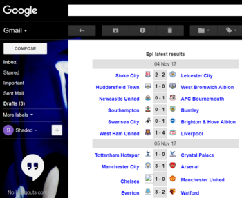
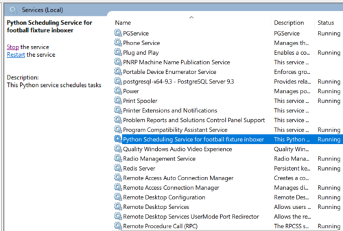

# FootyAlert
Got sick of repeatedly going on the bbc results page so I wrote an EPL and Man Utd fixture inboxer. Wrapped it in a windows service to run the scheduling job as a native OS task. Being a native windows service, footyAlert can be configured to automtically come on during windows start up. It sends the fixtures and results to your inbox as scheduled without you lifting a finger.

Will be looking to write in some international fixture support as well, especially since Nigeria's punched their Russia '18 ticket.

# Installation
[Python 3.4+](https://www.python.org/downloads/) is required.

Clone the git repo
```
git clone https://github.com/vaakinmade/footy-alert.git
```

# Dependencies

### Pycairo
Pycairo is required by cairosvg which this application uses to convert the football team crest images from svg to png. Using Christopher Gohlke's [libraries](https://www.lfd.uci.edu/~gohlke/pythonlibs/), download the appropriate pycairo .whl file for your python version and its bit version. Confirm your python's bit version from the welcome banner in the python shell.

From the confines of your virtualenv, install the pycairo .whl file.

```python
pip install pycairo_file_name.whl
```
The pycairo wheel file used by this application has been included in the root directory for your convenience. Note that it supports python 3.4 64 bit.

### Other dependencies

Install the other dependencies
```
pip install -r requirements.txt
```

### Email (gmail) Configuration
The `emailserver.py` is where email operations including composure and send-off occurs. Replace the default email address in this module with a valid email address. Since the `email_server.py` module attempts an email account sign-on, it becomes necessary that the account is configured to allow login from **less secure apps**. It is therefore recommended that you create a fresh email account solely for this purpose as it may become compromised afterwards.

### Turning on "Less secure apps" feature
Once signed into the new gmail/google account, go to;
> https://www.google.com/settings/security/lesssecureapps

Toggle the button to turn the feature on.

### Configuring the email's password 
In the `emailserver.py`, the gmail password (GMAIL_PWD), is retrieved from `gmail_key.py` which has been further decoupled to avoid inadequate exposure. Be sure to always use python decouple when dealing with secret keys, api auths, passwords etc. in files that end up online. See [python decouple](https://pypi.python.org/pypi/python-decouple) to get started.

# Usage
To install footyAlert as a native windows service, run;
```python
python winservice.py install
```
This installs the program as a native windows app that is manageable from windows services. Go on Services and you should see this;
  

To uninstall footyAlert;
```python
python winservice.py remove
```
This uninstalls and removes footyAlert from windows services.

## TO-DOs
- unit tests
- bits of design glossing maybe, maybe not 

